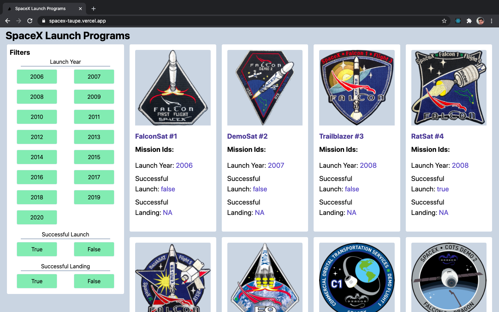
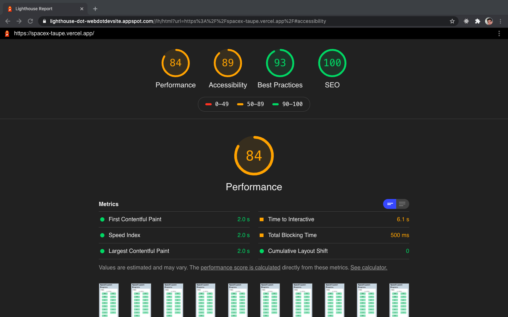

# SpaceX Launch Program

A front-end application which would help users list and browse all launches by SpaceX program.



### Lighthouse Report

[Click here](https://lighthouse-dot-webdotdevsite.appspot.com//lh/html?url=https%3A%2F%2Fspacex-taupe.vercel.app%2F) to see the lighthouse report for Performance, SEO, Accessibility, and Best Practices.



## Setup

### Installation

```bash
git clone git@github.com:amrendra451/spacex.git
cd spacex
yarn install or npm install
```

#### Development mode

In the development environment, a frontend server is running on port `3000`.

```bash
npm run dev or yarn run dev
```

Go to `localhost:3000` to view the app.

## Author

- [Amrendra Nath](https://github.com/amrendra451)
